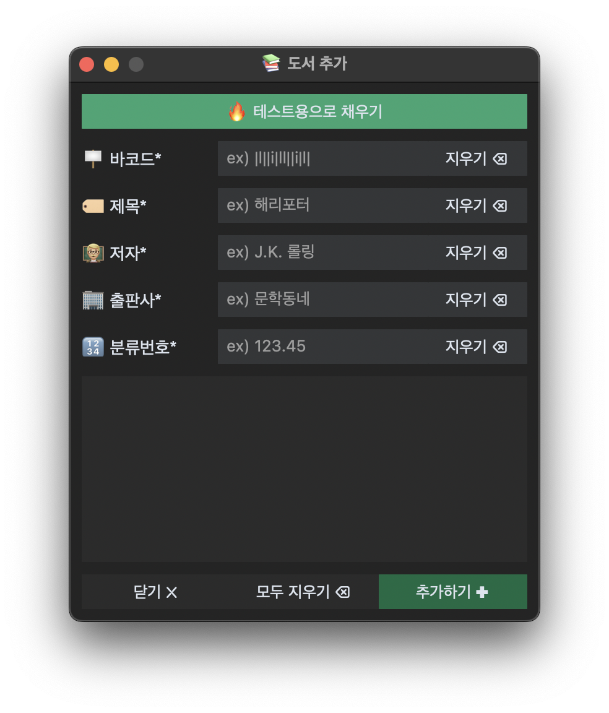
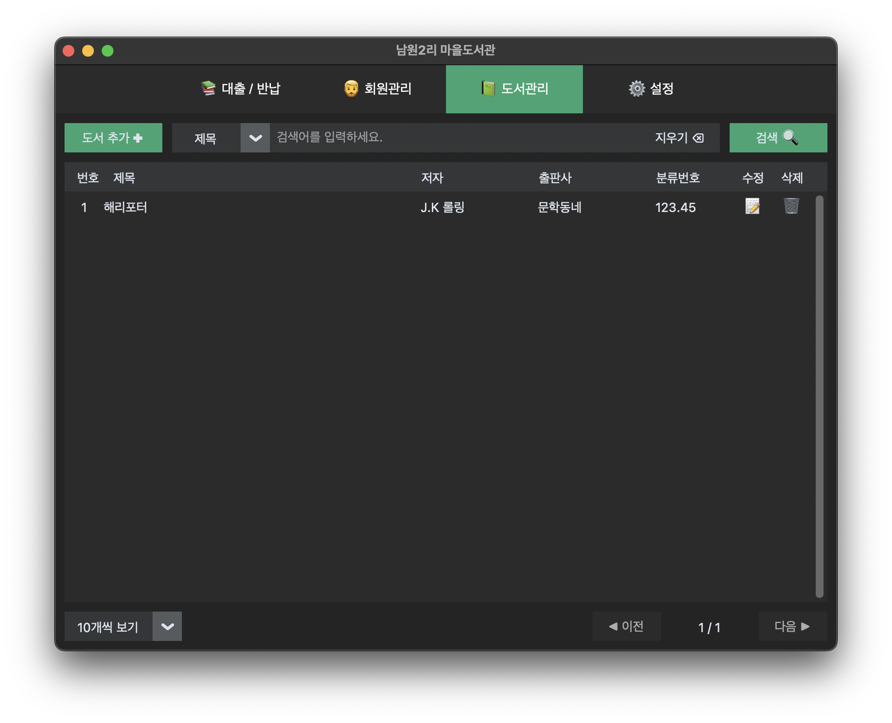
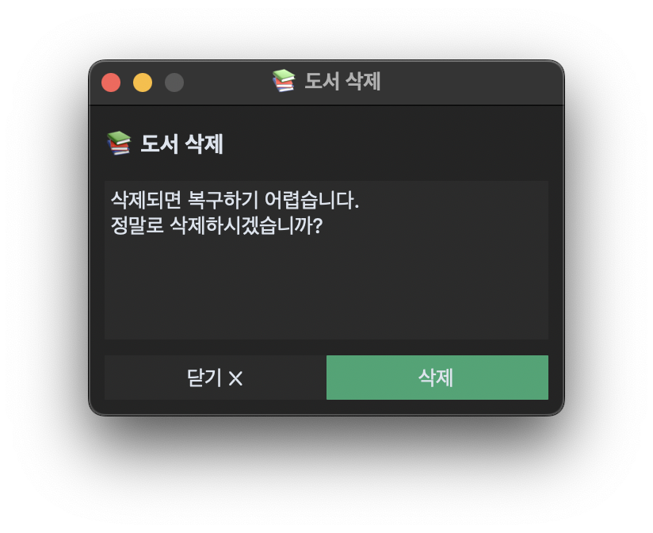
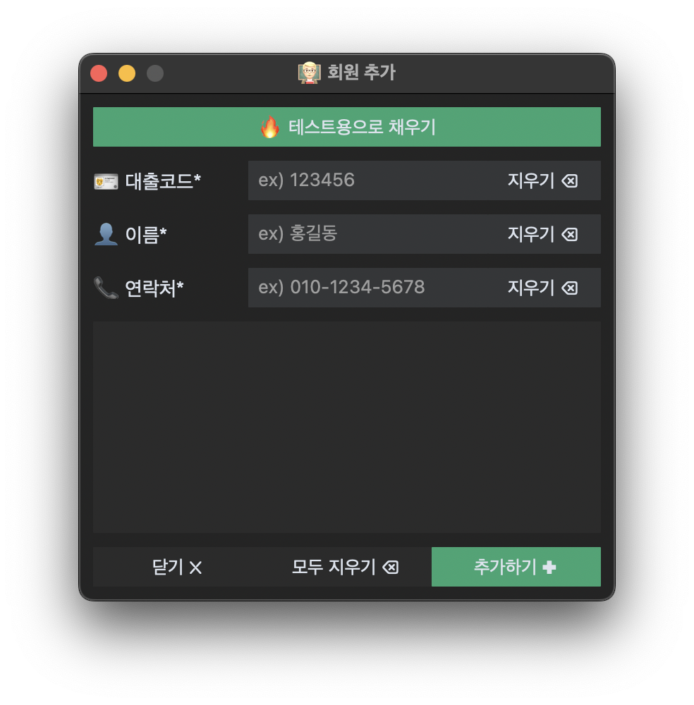
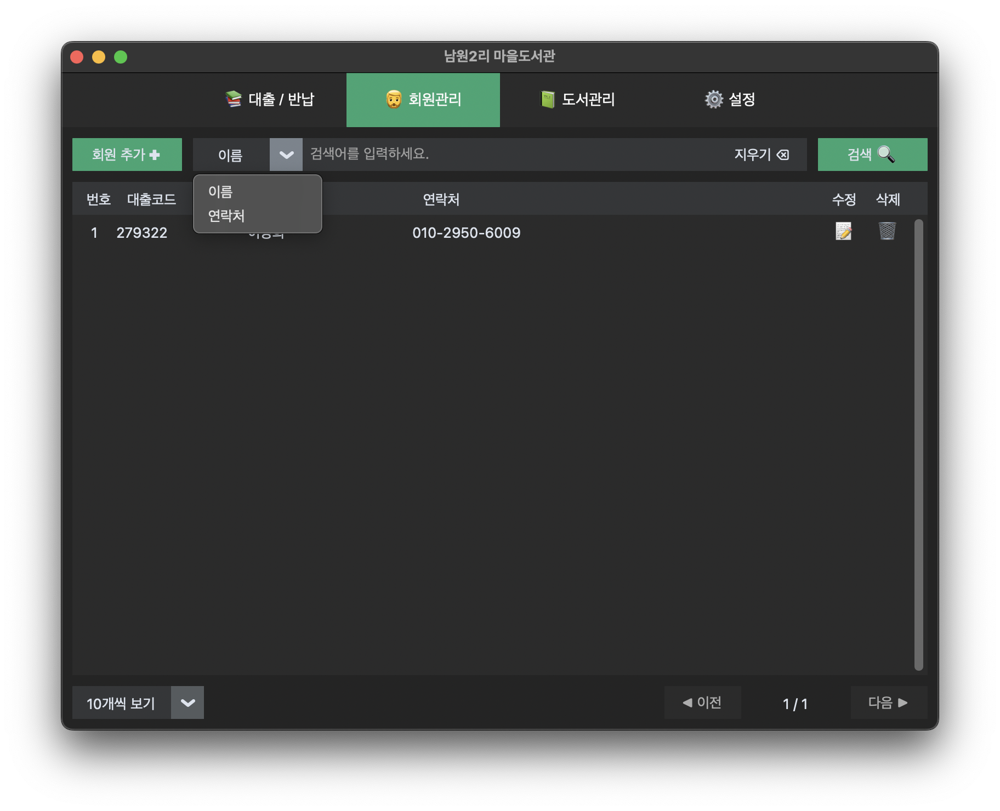
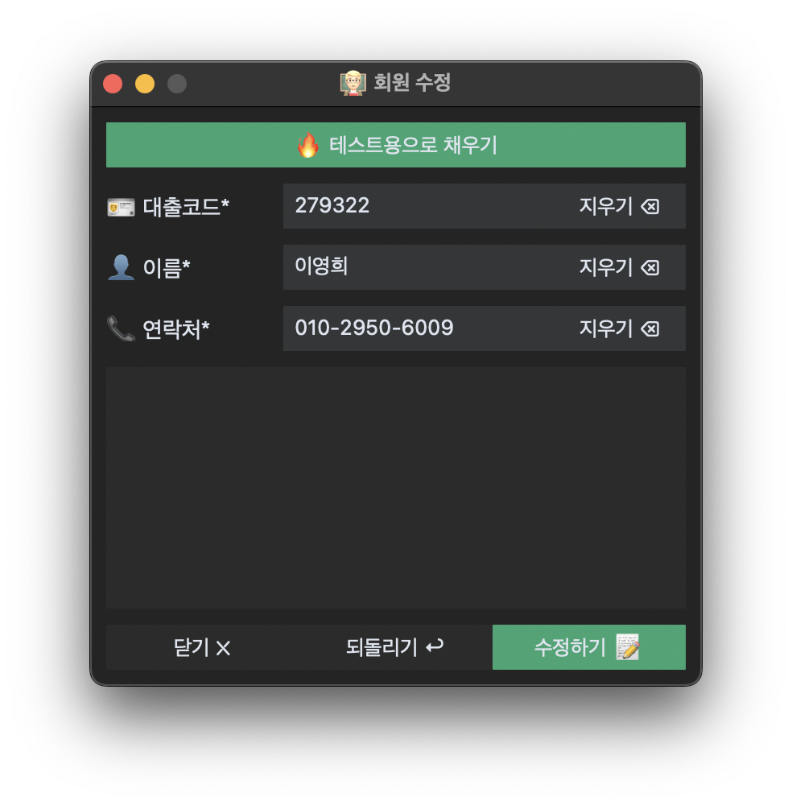
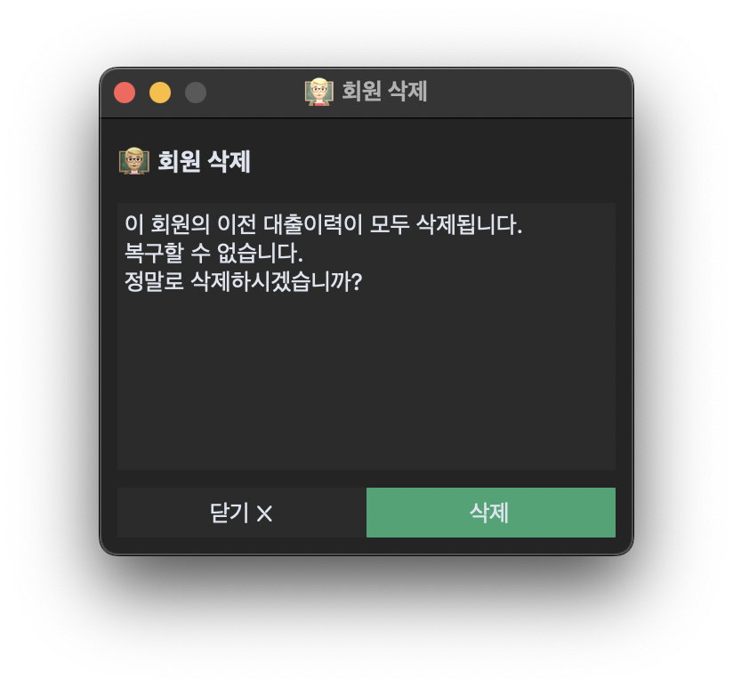
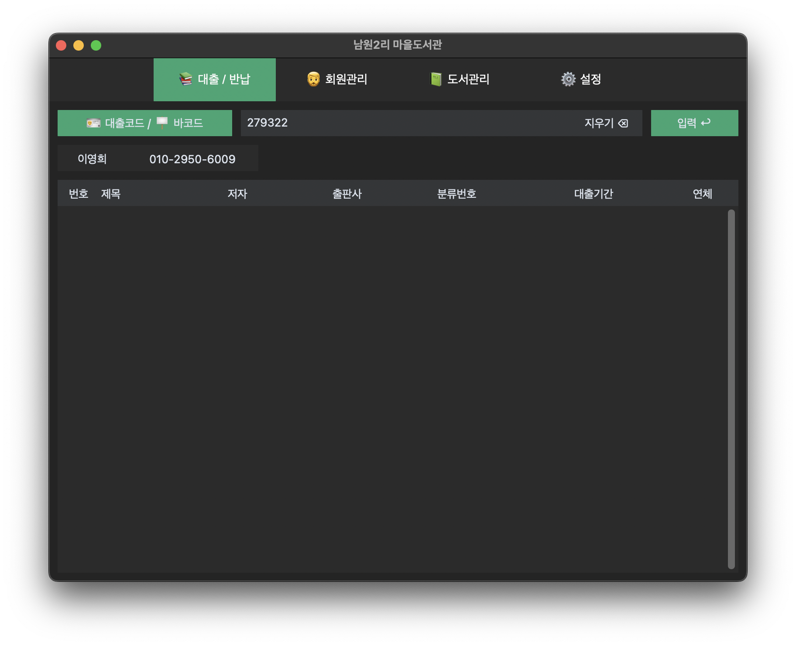
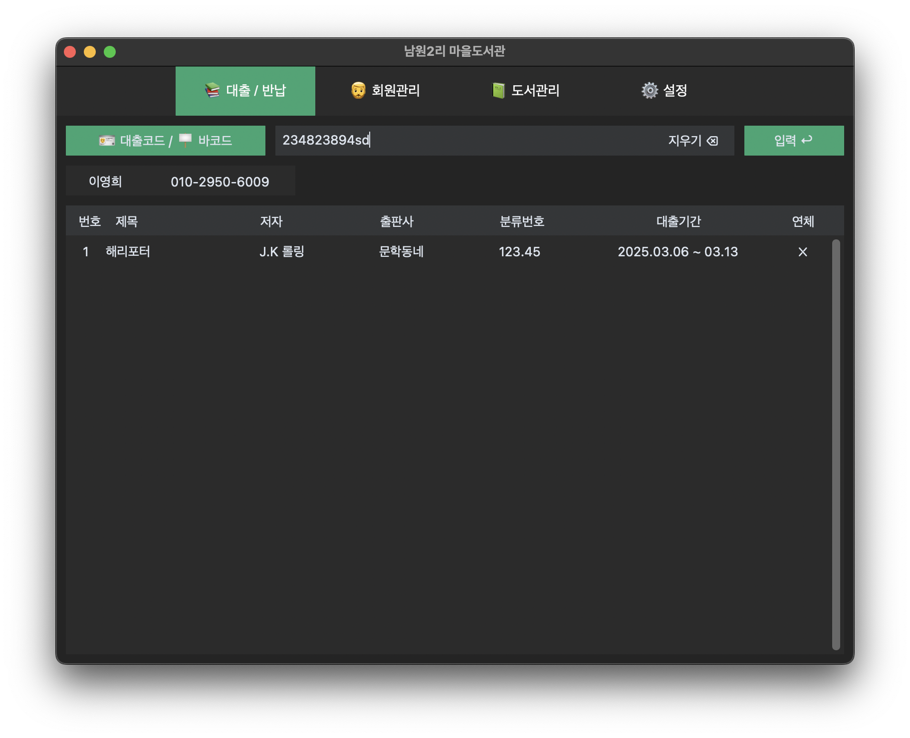

<a id="readme-top"></a>

<div align="center">
  <br />
  
</div>

# 📋 개요


LoanService는 인터넷이 되지 않는 환경에서도 작동하는 도서 관리 프로그램 입니다. 일반적으로 사용되는 도서 대출·반납 시스템의 기능들을 사용할 수 있습니다.

특히 서버를 거치지 않으므로 인터넷이 없는 환경에서도 작동하며, 파이썬을 작성되어 있어 파이썬 인터프리터가 작동하고 tkinter가 동작하는 모든 환경에서 사용할 수 있습니다.

## 🛠️ 기술스택

     

## ⚙️ 기능

### ➕ 도서 추가



도서의 추가를 위해 나오는 화면을 보여줍니다. 

1. *가 표시된 요소는 필수로 채워야하는 요소입니다.
2. 요소를 입력하는 부분의 오른쪽에 있는 지우기 버튼은 해당 요소에 적힌 내용을 전부 지웁니다.
3. 바코드는 바코드 스캐너를 사용하여 책에 있는 바코드를 스캔하여 입력할 수 있습니다.
4. 분류번호는 [한국십진분류체계](https://if-blog.tistory.com/10987) 를 따릅니다.
5. 하단의 빈공간은 관련된 메시지를 띄우는 용도입니다. 만약 도서를 추가하는데 실패했다면, 에러메시지와 코드가 해당 공간에 나옵니다.

> **🔥 테스트용으로 채우기** 는 <br>
> 프로그램을 빌드하지 않고 개발모드로 실행했을 경우 나타납니다. 개발환경에서 테스트를 쉽게하기 위해 만든 것으로 production에서는 나타나지 않습니다.


### 🔍 도서 검색



도서를 검색하기 위한 화면을 보여줍니다.

1. 도서는 제목이나 저자, 십진분류코드로 검색할 수 있습니다.
2. 검색된 도서는 표의 형태로 제공되며, 도서의 수정이나 삭제를 원할 경우, 해당하는 아이콘을 클릭하여 도서의 정보를 수정하거나 도서를 삭제할 수 있습니다.
3. 검색의 결과는 좌하단의 10개씩 보기, 20개씩 보기 등의 보기 규칙을 사용하여 적절하게 잘라서 볼 수 있습니다.
4. 검색된 도서가 많을 경우 여러 페이지로 보여지며 우하단의 이전·다음 버튼을 눌러 페이지를 넘길 수 있습니다.

### ✏️ 도서 정보 수정


1. *가 표시된 요소는 필수로 채워야하는 요소입니다.
2. 되돌리기 버튼을 누르면 요소의 수정을 취소하고 원래의 정보로 되돌립니다.
3. 하단의 빈공간은 추가하기와 같이 오류와 관련된 메시지를 표시하는 용도이며, 수정이 실패하였을 경우 메시지가 표시됩니다.

> **🔥 테스트용으로 채우기** 는 <br>
> 프로그램을 빌드하지 않고 개발모드로 실행했을 경우 나타납니다. 개발환경에서 테스트를 쉽게하기 위해 만든 것으로 production에서는 나타나지 않습니다.

### 🗑️ 도서 삭제



1. 닫기 버튼을 눌러 도서 삭제를 취소하고 창을 닫을 수 있습니다.
2. 삭제 버튼을 눌러 도서를 삭제합니다. 삭제가 완료되면 창이 자동으로 닫힙니다.
3. 도서 삭제에 실패했을 경우, 가운데 창에 경고메시지가 사라지고 에러메시지가 표시됩니다.

### ➕ 회원 추가



1. *가 표시된 요소는 필수로 채워야하는 요소입니다.
2. 대출코드는 회원마다 고유해야하며, 중복된 대출코드를 사용하여 회원을 추가하려고 한다면 추가하기 버튼을 눌렀을 때, 하단 빈공간에 에러가 출력됩니다.

> **🔥 테스트용으로 채우기** 는 <br>
> 프로그램을 빌드하지 않고 개발모드로 실행했을 경우 나타납니다. 개발환경에서 테스트를 쉽게하기 위해 만든 것으로 production에서는 나타나지 않습니다.

### 🔍 회원 검색



1. 회원의 이름이나 전화번호로 검색할 수 있습니다.
2. 검색된 회원은 표의 형태로 제공되며, 회원의 수정이나 삭제를 원할 경우, 해당하는 아이콘을 클릭하여 회원의 정보를 수정하거나 회원을 삭제할 수 있습니다.
3. 검색의 결과는 좌하단의 10개씩 보기, 20개씩 보기 등의 보기 규칙을 사용하여 적절하게 잘라서 볼 수 있습니다.
4. 검색된 회원이 많을 경우 여러 페이지로 보여지며 우하단의 이전·다음 버튼을 눌러 페이지를 넘길 수 있습니다.

### ✏️ 회원 정보 수정



1. *가 표시된 요소는 필수로 채워야하는 요소입니다.
2. 되돌리기 버튼을 누르면 요소의 수정을 취소하고 원래의 정보로 되돌립니다.
3. 하단의 빈공간은 추가하기와 같이 오류와 관련된 메시지를 표시하는 용도이며, 수정이 실패하였을 경우 메시지가 표시됩니다.

> **🔥 테스트용으로 채우기** 는 <br>
> 프로그램을 빌드하지 않고 개발모드로 실행했을 경우 나타납니다. 개발환경에서 테스트를 쉽게하기 위해 만든 것으로 production에서는 나타나지 않습니다.

### 🗑️ 회원 삭제



1. 닫기 버튼을 눌러 회원 삭제를 취소하고 창을 닫을 수 있습니다.
2. 삭제 버튼을 눌러 회원을 삭제합니다. 삭제가 완료되면 창이 자동으로 닫힙니다.
3. 회원 삭제에 실패했을 경우, 가운데 창에 경고메시지가 사라지고 에러메시지가 표시됩니다.

### 📤 대출 기능



1. 대출코드 / 바코드 입력란에 회원번호를 적고, 입력 버튼을 누릅니다.
2. 입력된 회원번호를 가진 회원이 있을 경우, 대출코드 / 바코드 밑에 회원의 이름과 회원의 전화번호 그리고 회원이 대출한 도서의 목록이 아래의 표에 표시됩니다.

> 위의 예시에서는 회원이 대출한 책이 없으므로 아무것도 표시되지 않습니다.



3. 대출코드 / 바코드 입력란에 도서의 바코드를 입력하고 입력을 누릅니다.
4. 해당 회원의 이름으로 대출이 완료되어 대출한 도서 목록에 도서가 표시됩니다.

### 📥 반납 기능


1. 먼저 대출 기능의 1번 2번 과정을 완료하여 회원이 대출한 도서 목록이 표시되도록 합니다.
2. 대출코드 / 바코드 입력란에 도서의 바코드를 입력하고 입력을 누릅니다.
3. 입력한 바코드에 해당하는 도서가 반납되어 대출 도서 목록에서 사라집니다.

## 📦 패키징

1. uv [설치](https://github.com/astral-sh/uv), 가상환경 준비

   ```bash
   uv venv;
   uv pip install;
   ```

2. ⚠️ data/data.db 초기화

   ```bash
   rm -rf data
   mkdir data
   touch data/data.db
   ```

3. 패키징

   ```bash
   pyinstaller --clean --noconfirm main.spec
   ```