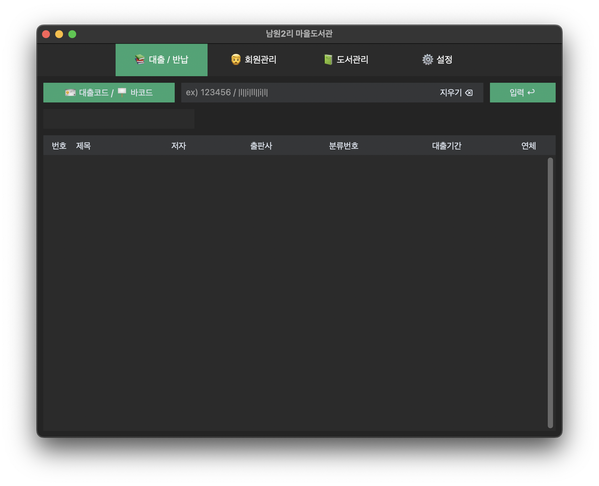
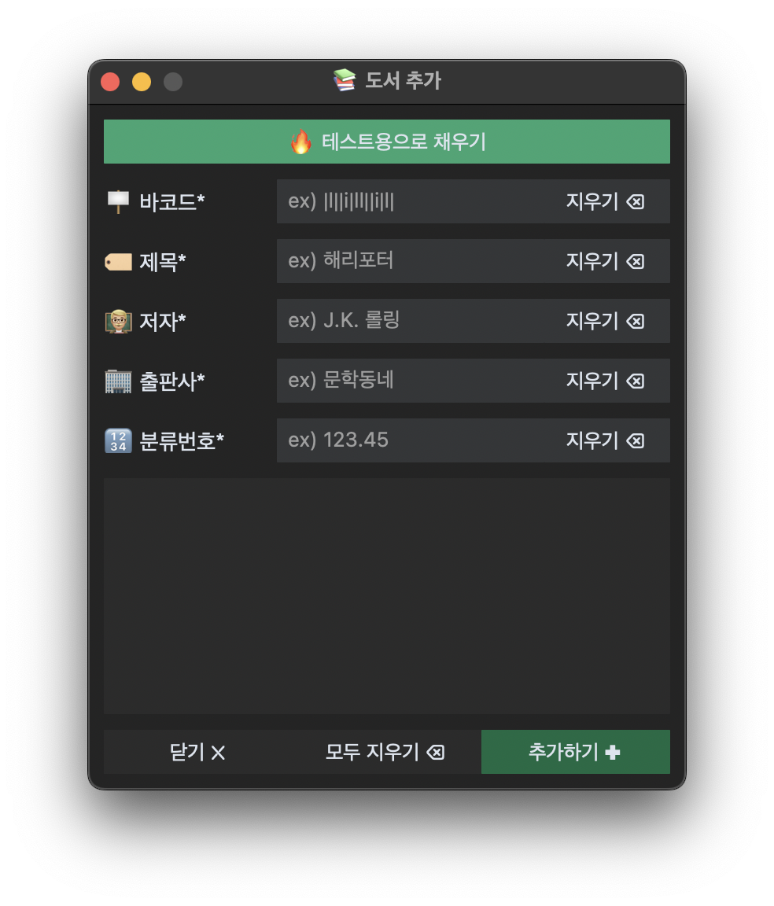
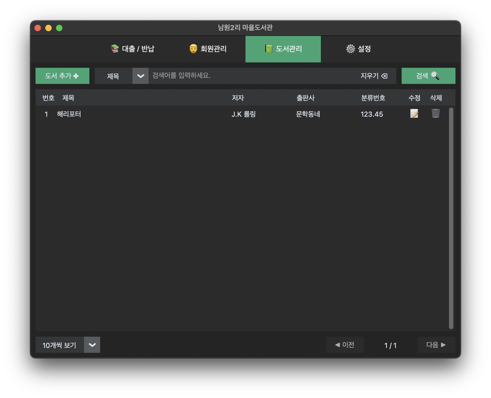
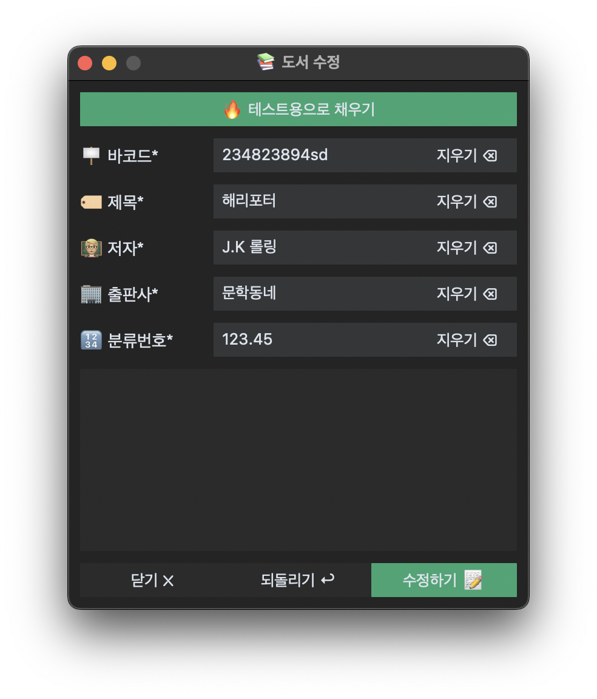
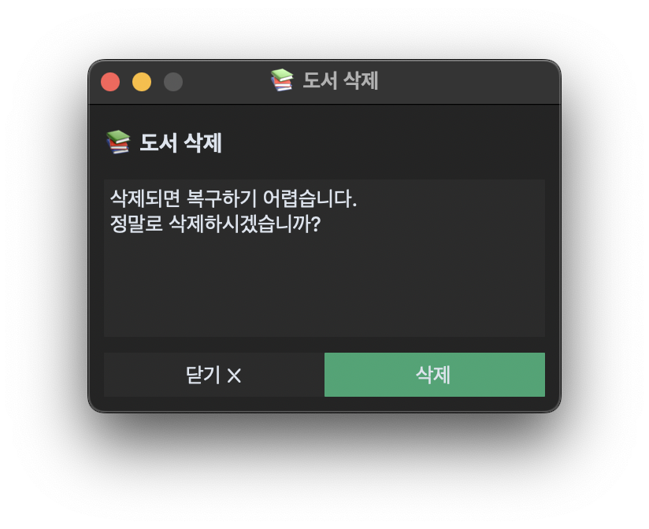
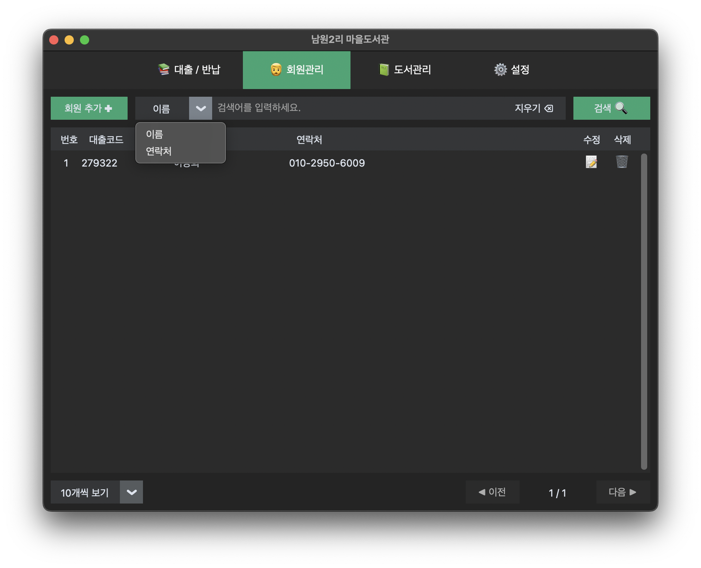
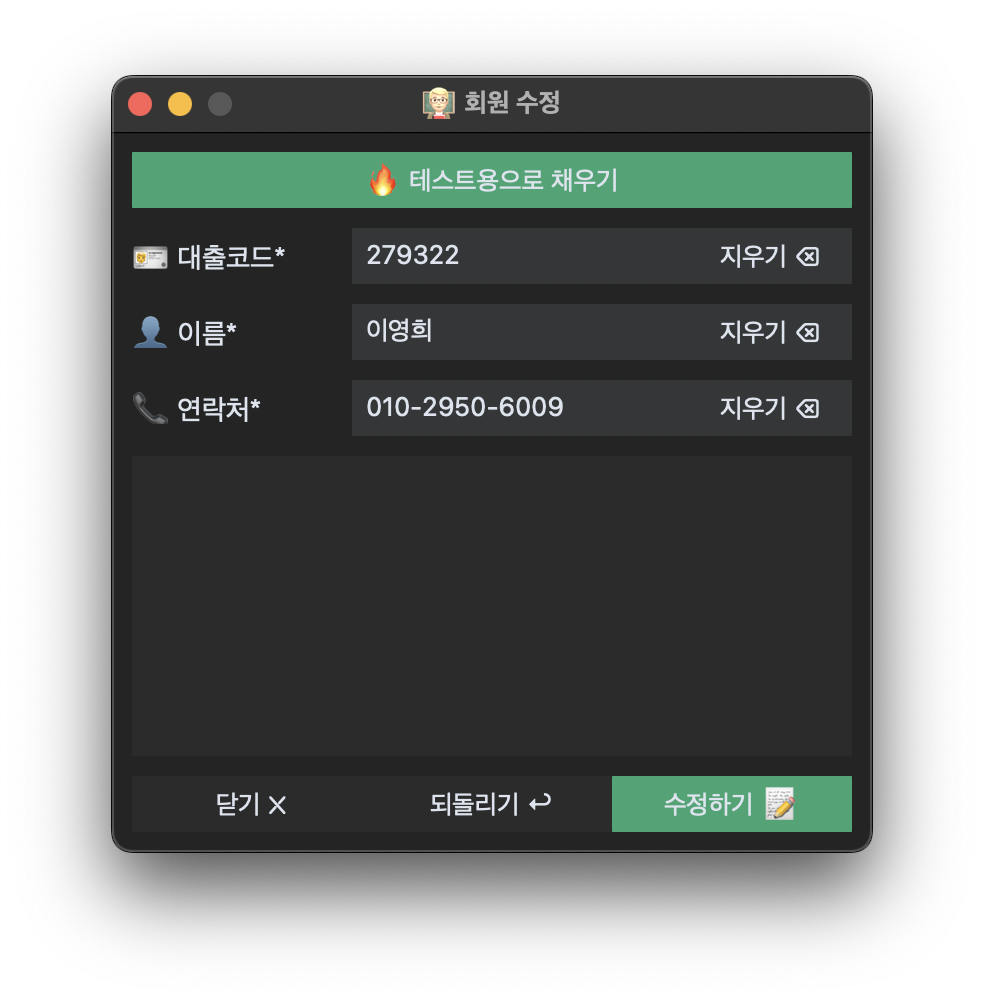
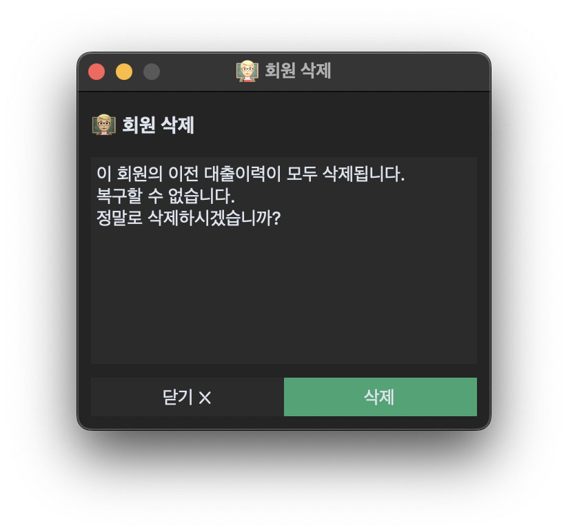
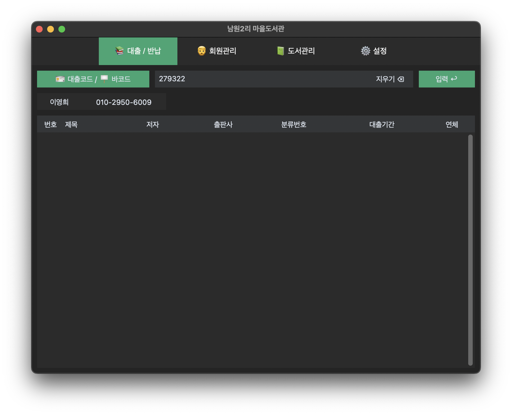
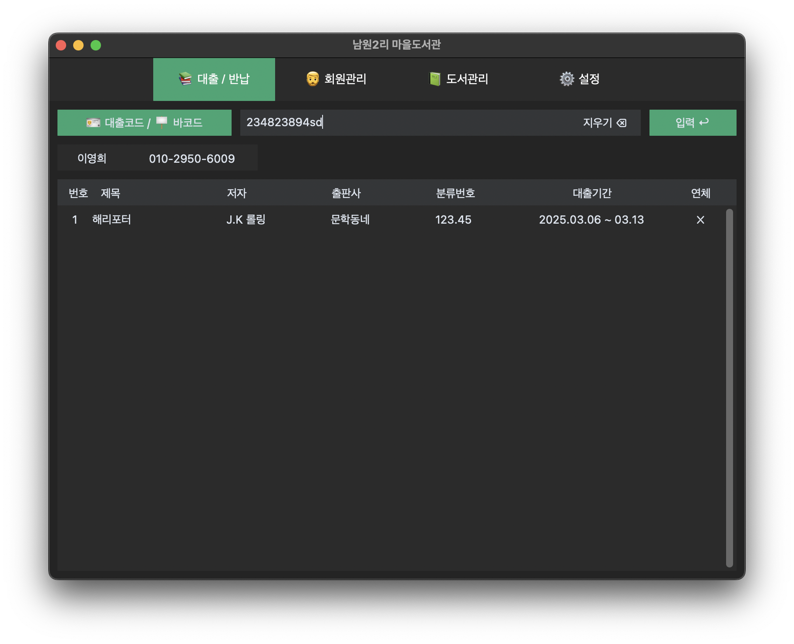

<a id="readme-top"></a>

<div align="center">
  
  <h3>ReFolder</h3>
</div>

# 개요



LoanService는 인터넷이 되지 않는 환경에서도 작동하는 도서 관리 프로그램 입니다. 일반적으로 사용되는 도서 대출·반납 시스템의 기능들을 사용할 수 있습니다.

특히 서버를 거치지 않으므로 인터넷이 없는 환경에서도 작동하며, 파이썬을 작성되어 있어 파이썬 인터프리터가 작동하고 tkinter가 동작하는 모든 환경에서 사용할 수 있습니다.

# 기능

## 도서와 관련된 기능

### 도서 추가



도서의 추가를 위해 나오는 화면을 보여줍니다. 

- *가 표시된 요소는 필수로 채워야하는 요소입니다.
- 요소를 입력하는 부분의 오른쪽에 있는 지우기 버튼은 해당 요소에 적힌 내용을 전부 지웁니다.
- 바코드는 바코드 스캐너를 사용하여 책에 있는 바코드를 스캔하여 입력할 수 있습니다.
- 분류번호는 [한국십진분류체계](https://if-blog.tistory.com/10987) 를 따릅니다.
- 하단의 빈공간은 관련된 메시지를 띄우는 용도입니다. 만약 도서를 추가하는데 실패했다면, 에러메시지와 코드가 해당 공간에 나옵니다.

> **🔥 테스트용으로 채우기** 는 <br>
> 프로그램을 빌드하지 않고 개발모드로 실행했을 경우 나타납니다. 개발환경에서 테스트를 쉽게하기 위해 만든 것으로 production에서는 나타나지 않습니다.


### 도서 검색



도서를 검색하기 위한 화면을 보여줍니다.

- 도서는 제목이나 저자, 십진분류코드로 검색할 수 있습니다.
- 검색된 도서는 표의 형태로 제공되며, 도서의 수정이나 삭제를 원할 경우, 해당하는 아이콘을 클릭하여 도서의 정보를 수정하거나 도서를 삭제할 수 있습니다.
- 검색의 결과는 좌하단의 10개씩 보기, 20개씩 보기 등의 보기 규칙을 사용하여 적절하게 잘라서 볼 수 있습니다.
- 검색된 도서가 많을 경우 여러 페이지로 보여지며 우하단의 이전·다음 버튼을 눌러 페이지를 넘길 수 있습니다.

### 도서 정보 수정



- *가 표시된 요소는 필수로 채워야하는 요소입니다.
- 되돌리기 버튼을 누르면 요소의 수정을 취소하고 원래의 정보로 되돌립니다.
- 하단의 빈공간은 추가하기와 같이 오류와 관련된 메시지를 표시하는 용도이며, 수정이 실패하였을 경우 메시지가 표시됩니다.

> **🔥 테스트용으로 채우기** 는 <br>
> 프로그램을 빌드하지 않고 개발모드로 실행했을 경우 나타납니다. 개발환경에서 테스트를 쉽게하기 위해 만든 것으로 production에서는 나타나지 않습니다.

### 도서 삭제



- 닫기 버튼을 눌러 도서 삭제를 취소하고 창을 닫을 수 있습니다.
- 삭제 버튼을 눌러 도서를 삭제합니다. 삭제가 완료되면 창이 자동으로 닫힙니다.
- 도서 삭제에 실패했을 경우, 가운데 창에 경고메시지가 사라지고 에러메시지가 표시됩니다.

## 회원과 관련된 기능

### 회원 추가


- *가 표시된 요소는 필수로 채워야하는 요소입니다.
- 대출코드는 회원마다 고유해야하며, 중복된 대출코드를 사용하여 회원을 추가하려고 한다면 추가하기 버튼을 눌렀을 때, 하단 빈공간에 에러가 출력됩니다.

> **🔥 테스트용으로 채우기** 는 <br>
> 프로그램을 빌드하지 않고 개발모드로 실행했을 경우 나타납니다. 개발환경에서 테스트를 쉽게하기 위해 만든 것으로 production에서는 나타나지 않습니다.

### 회원 검색



- 회원의 이름이나 전화번호로 검색할 수 있습니다.
- 검색된 회원은 표의 형태로 제공되며, 회원의 수정이나 삭제를 원할 경우, 해당하는 아이콘을 클릭하여 회원의 정보를 수정하거나 회원을 삭제할 수 있습니다.
- 검색의 결과는 좌하단의 10개씩 보기, 20개씩 보기 등의 보기 규칙을 사용하여 적절하게 잘라서 볼 수 있습니다.
- 검색된 회원이 많을 경우 여러 페이지로 보여지며 우하단의 이전·다음 버튼을 눌러 페이지를 넘길 수 있습니다.

### 회원 정보 수정



- *가 표시된 요소는 필수로 채워야하는 요소입니다.
- 되돌리기 버튼을 누르면 요소의 수정을 취소하고 원래의 정보로 되돌립니다.
- 하단의 빈공간은 추가하기와 같이 오류와 관련된 메시지를 표시하는 용도이며, 수정이 실패하였을 경우 메시지가 표시됩니다.

> **🔥 테스트용으로 채우기** 는 <br>
> 프로그램을 빌드하지 않고 개발모드로 실행했을 경우 나타납니다. 개발환경에서 테스트를 쉽게하기 위해 만든 것으로 production에서는 나타나지 않습니다.

### 회원 삭제



- 닫기 버튼을 눌러 도서 삭제를 취소하고 창을 닫을 수 있습니다.
- 삭제 버튼을 눌러 도서를 삭제합니다. 삭제가 완료되면 창이 자동으로 닫힙니다.
- 회원 삭제에 실패했을 경우, 가운데 창에 경고메시지가 사라지고 에러메시지가 표시됩니다.

## 대출 반납과 관련된 기능



1. 대출코드 / 바코드 입력란에 회원번호를 적고, 입력 버튼을 누릅니다.
2. 입력된 회원번호를 가진 회원이 있을 경우, 대출코드 / 바코드 밑에 회원의 이름과 회원의 전화번호 그리고 회원이 대출한 도서의 목록이 아래의 표에 표시됩니다.

> 위의 예시에서는 회원이 대출한 책이 없으므로 아무것도 표시되지 않습니다.

### 대출 기능



3. 대출코드 / 바코드 입력란에 도서의 바코드를 입력하고 입력을 누릅니다.
4. 해당 회원의 이름으로 대출이 완료되어 대출한 도서 목록에 도서가 표시됩니다.

### 반납 기능


5. 먼저 1번 2번 과정을 완료하여 회원이 대출한 도서 목록이 표시되도록 합니다.
6. 대출코드 / 바코드 입력란에 도서의 바코드를 입력하고 입력을 누릅니다.
7. 입력한 바코드에 해당하는 도서가 반납되어 대출 도서 목록에서 사라집니다.

# 개발환경 설정

### 기술스택

- 

   앱의 규모가 간단하고, 빠르게 만들어야할 필요성이 있었기 때문에 파이썬을 사용했습니다. 또한 앱을 패키징했을 때, 패키지의 사이즈를 고려하여 최대한 오랬동안 오프라인에서 안정적으로 작동할 수 있도록 하기 위해서 파이썬을 사용했습니다.

- 

   그냥 tkinter를 사용하기에는 정의된 기능이 너무 부족하고, 뼈대가 없다는 느낌을 받았습니다. 더 나은 기능과 디자인을 제공하기 위해서 customtkinter에 언어 선택이나 테마를 변경하는 기능을 추가하여 사용했습니다.

- 

   인터넷을 사용할 수 없는 환경에서도 작동하도록 구성하기 위해서 Postgres나 mysql을 사용할 수 없었고, 책의 데이터를 저장해두기 위해서 sqlite를 사용했습니다.

- 

   파이썬으로 작성된 ORM으로 sqlite의 관리를 보다 쉽게 하기 위해서 사용했습니다.

# 빌드 과정

### 빌드과정

1. uv를 설치

   자세한 설치방법은 [여기](https://github.com/astral-sh/uv)를 참고

2. 가상환경 생성

   ```pwsh
   uv venv
   ```

3. 필요한 패키지를 설치

   uv가 uv.lock파일을 살펴보고 적절한 버전에 맞는 패키지를 설치합니다.

   ```pwsh
   uv pip install
   ```

3. 터미널에 다음의 명령어를 입력하여, 빌드

   ```pwsh
   pyinstaller -w --add-data "./assets/*:assets" --add-data "./assets/themes/*:assets/themes" --add-data "./data/*:data" ./main.py
   ```
   -w : 빌드결과를 실행했을 때, 터미널창이 실행되지 않고 윈도우창만 나오도록 함

   --add-data "{src}:{des}" : {src}에 해당하는 파일을 빌드결과 {des}에 옮기도록 함. 수행하지 않을 경우 빌드결과물을 실행했을 때, 해당 리소스를 찾을 수 없다며 에러를 일으킴.

   또는 아래의 방법으로 spec 파일을 사용하여 빌드

   ```pwsh
   pyinstaller --clean --noconfirm main.spec
   ```

### 주의사항

1. data.db 파일의 초기화

   테스트할 때 사용했던 db파일이 그대로 빌드결과에 들어가기 때문에, 이를 방지하기 위해서 db파일을 초기화한 후에 빌드를 하는 것이 좋음.
   
   db파일을 삭제한 후에 빌드해 보았으나, 삭제한 경우에는 빌드결과에 /data 폴더도 만들어지지 않아서 경로오류를 일으키며 실행이 안됨.

# Tips

### 필요한 아이콘을 가져오는 방법 (deprecated : 해봤는데 아이콘 깨짐)

1. https://fontawesome.com/ 사이트로 이동한다.

2. 무료로 제공되는 svg 아이콘중 적절한 아이콘을 다운받는다.

3. assets/svg 폴더에 다운받은 파일을 넣는다.

4. svg를 png로 변환

   - src/svg_converter.py 를 실행시킨다.

     ```pwsh
     python ./src/svg_converter.py
     ```

     꼭 위와 같이 실행시킬 필요는 없고, 터미널이 프로젝트 폴더에 있는 상태에서 svg_converter.py를 실행시킬 수 있으면 된다.

     실행이 완료되면, svg폴더에 있는 파일과 똑같은 png파일이 assets.png폴더에 생성될 것이다.

     예를 들어 book.svg를 svg폴더에 넣었다면, book.png가 png폴더에 생성된다.

   - [SVG](https://marketplace.visualstudio.com/items?itemName=jock.svg)를 사용한다.

     [SVG](https://marketplace.visualstudio.com/items?itemName=jock.svg) 확장프로그램을 설치했다면 SVG Preview를 열고, |-> 버튼을 눌러 svg파일을 png파일로 변환시킨다.

5. 변환된 png파일을 프로젝트에서 사용한다.
